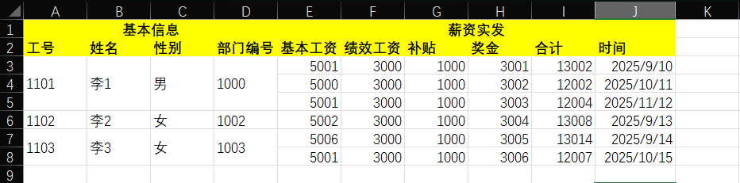
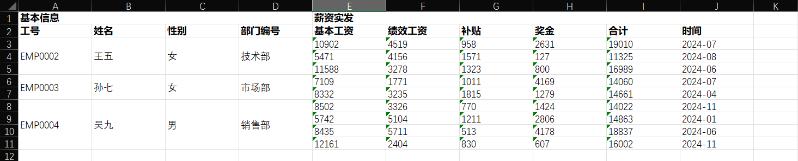

# SimpleWorkbookMapper

一个基于Apache POI的Excel-JavaBean映射工具，支持将Excel文件自动映射为Java对象，以及将Java对象导出为Excel文件。

## 🌟 示例

### 1. 读取
表格示例

读取到的数据
```json
{
  "complexSheet": {
    "data": [
      {
        "complexBaseInfo": {
          "department": "1000.0",
          "jobNumber": "1101.0",
          "name": "李1",
          "sex": "男"
        },
        "complexSalaries": [
          {
            "allowance": "1000.0",
            "base": "5001.0",
            "bonus": "3001.0",
            "date": "45910.0",
            "performance": "3000.0",
            "total": "13002.0"
          },
          {
            "allowance": "1000.0",
            "base": "5000.0",
            "bonus": "3002.0",
            "date": "45941.0",
            "performance": "3000.0",
            "total": "12002.0"
          },
          {
            "allowance": "1000.0",
            "base": "5001.0",
            "bonus": "3003.0",
            "date": "45973.0",
            "performance": "3000.0",
            "total": "12004.0"
          }
        ],
        "rowId": "0"
      },
      {
        "complexBaseInfo": {
          "department": "1002.0",
          "jobNumber": "1102.0",
          "name": "李2",
          "sex": "女"
        },
        "complexSalaries": [
          {
            "allowance": "1000.0",
            "base": "5002.0",
            "bonus": "3004.0",
            "date": "45913.0",
            "performance": "3000.0",
            "total": "13008.0"
          }
        ],
        "rowId": "1"
      },
      {
        "complexBaseInfo": {
          "department": "1003.0",
          "jobNumber": "1103.0",
          "name": "李3",
          "sex": "女"
        },
        "complexSalaries": [
          {
            "allowance": "1000.0",
            "base": "5006.0",
            "bonus": "3005.0",
            "date": "45914.0",
            "performance": "3000.0",
            "total": "13014.0"
          },
          {
            "allowance": "1000.0",
            "base": "5001.0",
            "bonus": "3006.0",
            "date": "45945.0",
            "performance": "3000.0",
            "total": "12007.0"
          }
        ],
        "rowId": "2"
      }
    ],
    "titleRowCount": 2
  }
}
```

### 2.写入
数据示例
```json
{
  "complexSheet": {
    "list": [
      {
        "complexBaseInfo": {
          "jobNumber": "EMP0002",
          "name": "王五",
          "sex": "女",
          "department": "技术部"
        },
        "complexSalaries": [
          {
            "base": "10902",
            "performance": "4519",
            "allowance": "958",
            "bonus": "2631",
            "total": "19010",
            "date": "2024-07"
          },
          {
            "base": "5471",
            "performance": "4156",
            "allowance": "1571",
            "bonus": "127",
            "total": "11325",
            "date": "2024-08"
          },
          {
            "base": "11588",
            "performance": "3278",
            "allowance": "1323",
            "bonus": "800",
            "total": "16989",
            "date": "2024-06"
          }
        ]
      },
      {
        "complexBaseInfo": {
          "jobNumber": "EMP0003",
          "name": "孙七",
          "sex": "女",
          "department": "市场部"
        },
        "complexSalaries": [
          {
            "base": "7109",
            "performance": "1771",
            "allowance": "1011",
            "bonus": "4169",
            "total": "14060",
            "date": "2024-07"
          },
          {
            "base": "8332",
            "performance": "3235",
            "allowance": "1815",
            "bonus": "1279",
            "total": "14661",
            "date": "2024-04"
          }
        ]
      },
      {
        "complexBaseInfo": {
          "jobNumber": "EMP0004",
          "name": "吴九",
          "sex": "男",
          "department": "销售部"
        },
        "complexSalaries": [
          {
            "base": "8502",
            "performance": "3326",
            "allowance": "770",
            "bonus": "1424",
            "total": "14022",
            "date": "2024-11"
          },
          {
            "base": "5742",
            "performance": "5104",
            "allowance": "1211",
            "bonus": "2806",
            "total": "14863",
            "date": "2024-01"
          },
          {
            "base": "8435",
            "performance": "5711",
            "allowance": "513",
            "bonus": "4178",
            "total": "18837",
            "date": "2024-06"
          },
          {
            "base": "12161",
            "performance": "2404",
            "allowance": "830",
            "bonus": "607",
            "total": "16002",
            "date": "2024-11"
          }
        ]
      }
    ],
    "titleRowCount": 0
  }
}
```
生成表格


## 📖 使用说明

### 1. 定义数据模型

首先创建继承自 `AbsSheetJavaObj` 的数据类：

```java
import com.simpleWorkbook.annotations.TitleField;
import com.simpleWorkbook.model.AbsSheetJavaObj;

public class SimpleSheet extends AbsSheetJavaObj {
    
    @TitleField(value = "姓名", colWidth = 20)
    private String name;
    
    @TitleField(value = "年龄", colWidth = 10)
    private String age;
    
    @TitleField(value = "性别", colWidth = 10, dictValues = {"男", "女"})
    private String sex;
    
    // getter和setter方法...
}
```

### 2. 定义工作簿模型

创建继承自 `AbsWorkbookJavaObj` 的工作簿类：

```java

public class SimpleWorkbook extends AbsWorkbookJavaObj {

    @SheetField("用户信息")
    private TitledListSheetPageObj<SimpleSheet> sheetPage;

    // getter和setter方法...
}
```

### 3. 读取Excel文件

```java
SimpleWorkbook workbook = SimpleWorkbookMapper.readWorkbook(SimpleWorkbook.class, "path/to/your/excel.xlsx");

List<SimpleSheet> dataList = workbook.getSheetPage().getData();
// 处理数据...
```

### 4. 写入Excel文件

```java
//创建workbook
SimpleWorkbook workbook = new SimpleWorkbook();

// 导出Excel
Workbook excelWorkbook = SimpleWorkbookMapper.writeWorkbook(workbook);

// 准备sheetPage，添加数据
TitledListAbsSheetPageObj<SimpleSheet> sheetPage = new TitledListAbsSheetPageObj<>();

// 保存到文件...
```

## 📝 注解说明

### @SheetField

用于标记工作簿中的sheet页面字段。

```java
@SheetField(value = "Sheet名称", rowHeight = 20)
private TitledListAbsSheetPageObj<YourDataType> sheetPage;
```

参数：
- `value`: sheet名称
- `rowHeight`: 行高（默认20）

### @TitleField

用于标记sheet中的标题字段。

```java
@TitleField(
    value = "列标题", 
    colWidth = 15,
    dictValues = {"选项1", "选项2"},
    dictSheetName = "字典Sheet",
    listValuesInSingleCell = false,
    listValuesInSingleCellSplitter = ","
)
private String fieldName;
```

参数：
- `value`: 列标题名称
- `colWidth`: 列宽（默认15）
- `dictValues`: 数据验证的下拉选项数组
- `dictSheetName`: 字典sheet名称（用于引用其他sheet的数据）
- `listValuesInSingleCell`: 是否在单个单元格中存储列表值
- `listValuesInSingleCellSplitter`: 列表值分隔符（默认","）

## ⚠️ 注意事项

1. **文件格式**：目前仅支持 `.xlsx` 格式
2. **Java版本**：需要Java 8或更高版本


## 📋 支持的数据类型

- `String`：基本字符串类型
- `List<String>`：字符串列表
- `List<? extends AbsSheetJavaObj>`：嵌套对象列表
- `? extends AbsSheetJavaObj`：嵌套对象

## 🤝 贡献

欢迎提交Issue和Pull Request来改进这个项目！

